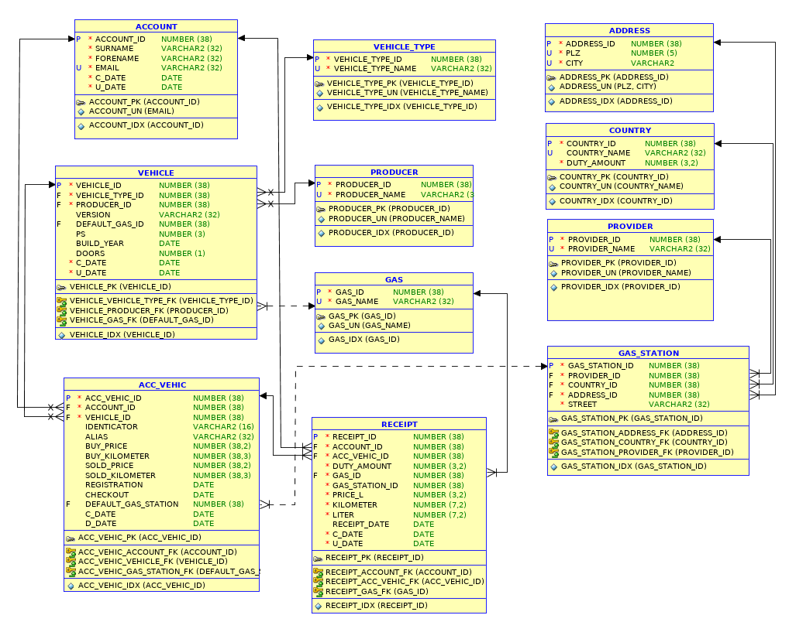

# Tutorium - Grundlagen Datenbanken - Blatt 2

## Vorbereitungen
* Für dieses Aufgabenblatt wird die SQL-Dump-Datei `schema_default.sql` benötigt, die sich im Verzeichnis `sql` befindet.
* Die SQL-Dump-Datei wird in SQL-Plus mittels `start <Dateipfad/zur/sql-dump-datei.sql>` in die Datenbank importiert.
* Beispiele
  * Linux `start ~/Tutorium.sql`
  * Windows `start C:\Users\max.mustermann\Desktop\Tutorium.sql`

## Datenbankmodell


## Aufgaben

### Aufgabe 1
Schaue dir das Datenbankmodell an. Wofür steht hinter dem Datentyp `NUMBER` die Zahlen in den runden Klammern?
Nehme dir die Oracle [Dokumentation](https://docs.oracle.com/cd/B28359_01/server.111/b28318/datatype.htm#CNCPT012) zu Hilfe.

#### Lösung
Deine schritliche Antwort.

### Aufgabe 2
Was bedeuten die durchgezogenen Linien, die zwischen einigen Tabellen abgebildet sind?

#### Lösung
Deine schriftliche Antwort.

### Aufgabe 3
Was bedeutet die gestrichelte Linie, die zwischen der Tabelle `ACC_VEHIC` und `GAS_STATION` abgebildet ist?

#### Lösung
Deine schriftliche Antwort.

### Aufgabe 4
Die folgende Abbildung beschreibt eine Beziehung zwischen Tabellen. Sie wird auch `n` zu `m` Beziehung genannt. Beschreibe kurz die Bedeutung dieser Beziehung.
Nehme dir diesen [Artikel](https://glossar.hs-augsburg.de/Beziehungstypen) zu Hilfe.


Deine schriftliche Antwort.

### Aufgabe 5
Was bedeutet der Buchstabe `P` und `F` neben den Attributen von Tabellen?

#### Lösung
Deine schriftliche Lösung.

### Aufgabe 6
Importiere die SQL-Dump-Datei in dein eigenes Schema. Wie lautet dazu der Befehl um dem import zu starten?

#### Lösung
```sql
Deine Lösung
```

### Aufgabe 7
Gebe alle Datensätze der Tabelle `ACCOUNT` aus.

#### Lösung
```sql
Deine Lösung
```

### Aufgabe 8
Modifiziere Aufgabe 7 so, dass nur die Spalte `ACCOUNT_ID` ausgegeben wird.

#### Lösung
```sql
Deine Lösung
```

### Aufgabe 9
Gebe alle Spalten der Tabelle `VEHICLE` aus.

#### Lösung
```sql
Deine Lösung
```

### Aufgabe 10
Kombiniere Aufgabe 7 und 9 so, dass nur Personen (`ACCOUNT`) angezeigt werden, die ein Auto (`VEHICLE`) besitzen.

#### Lösung
```sql
Deine Lösung
```

### Aufgabe 11
Modifizierde die Aufgabe 10 so, dass nur die Person mit der `ACCOUNT_ID` = `7` angezeigt wird.

#### Lösung
```sql
Deine Lösung
```

### Aufgabe 12
Erstelle für dich einen neuen Benutzer.
> Achtung, nutze für die Spalten `C_DATE` und `U_DATE` vorerst die Syntax `SYSDATE` - [Dokumentation](https://docs.oracle.com/cd/B19306_01/server.102/b14200/functions172.htm)

#### Lösung
```sql
Deine Lösung
```

### Aufgabe 13
Erstelle für deinen neuen Benutzer ein neues Auto. Dieses Auto dient als Vorlage für die nächten Aufgaben.

#### Lösung
```sql
Deine Lösung
```

### Aufgabe 14
Verknüpfe das aus Aufgabe 13 erstellte neue Auto mit deinem neuen Benutzer aus Aufgabe 12 in der Tabelle `ACC_VEHIC` und erstelle den ersten Rechnungsbeleg.

#### Lösung
```sql
Deine Lösung
```

### Aufgabe 15
Ändere den Vorname `SURNAME` des Datensatzes mit der ID `7` in der Tabelle `ACCOUNT` auf `Zimmermann`.

#### Lösung
```sql
Deine Lösung
```

### Aufgabe 16
Speichere alle Änderungen deiner offenen Transaktion. Wie lautet der SQL-Befehl dazu?

#### Lösung
```sql
Deine Lösung
```
